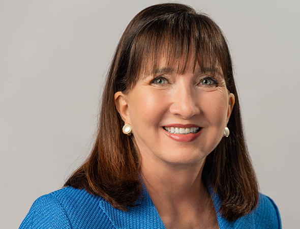

Jorgensen
# Jo Jorgensen 

## Motto 
  Break free from big goverment the first ones free real change for real people, I'm with her she's with us! Let her speak!!

## Platform
Jo Jorgensen opposes 
* Federal civil asset forfeiture and qualified immunity 
* The war on drugs 
* Drug Laws 
* Promising to pardon all nonviolent drug offenders 
* Military (de-militarization police) 

Jo Jorgensen Supports 
* Cutting government 
* Reducing taxes 
* American citizens to travel and trade 
* Wanting to eliminate trade barriers

## Background 
Jo Jorgenson is an American academic and a libertarian political activist. She was born May 1, 1957 in Libertyville, Illinois. Jo had attended Baylor University to receive her B.S. in Psychology followed by a Master's in Administration from Southern Methodist University. Finally she attended Clemson University receiving a Ph.D. in industrial and Organizational Psychology after becoming part owner and President of Digitech, Inc. In 1992 Jo Jorgensen ran for the United States House of Representatives election. She placed overall third with a 2.2% of the total vote. Jo Jorgensen filed with the FEC to be able to run for presidential election in 2020 on August 13, 2019. Jo officially became the Libertarian presidential nominee on May 23, 2020, making her the first woman to be a Libertarian nominee, and the only female presidential candidate of 2020 with ballot access to over 270 electoral votes. 

[Jo Jorgensons Official Page](https://jo20.com)

[Home Page](/README.md) 
