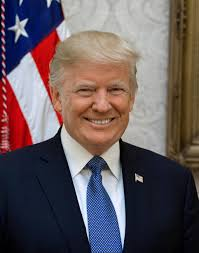

Trump
# Donald J. Trump 

## motto
# Keep america great.

## platform
### his 2020 pitch is to bring back the economy, boost jobs, protect US trade interests, and to continue with his hard-line stance on immigration. Also During his first campaign, Mr Trump promised huge tax cuts for working Americans, to lower the corporate tax rate, to shake up the trade status quo and to revive American manufacturing. On some of those, he has delivered.

## backround 
### Donald J. Trump was born on June 14th 1946 in New York City. Before Donald was president of the United States he was a real-estate developer and business man who owned several  hotels, casinos, golf courses, resorts, and residential properties all around the world. Trump was the fourth of five children of Frederick Christ Trump, a successful real estate developer, and Mary MacLeod. Donald’s eldest sister, Maryanne Trump Barry, eventually served as a U.S. district court judge and later as a judge on the U.S. Court of Appeals for the Third Circuit until her retirement in 2011. His elder brother, Frederick, Jr who worked briefly for his father’s business before becoming an airline pilot in the 1960s. Freddy’s alcoholism led to his early death in 1981, at the age of 43.
